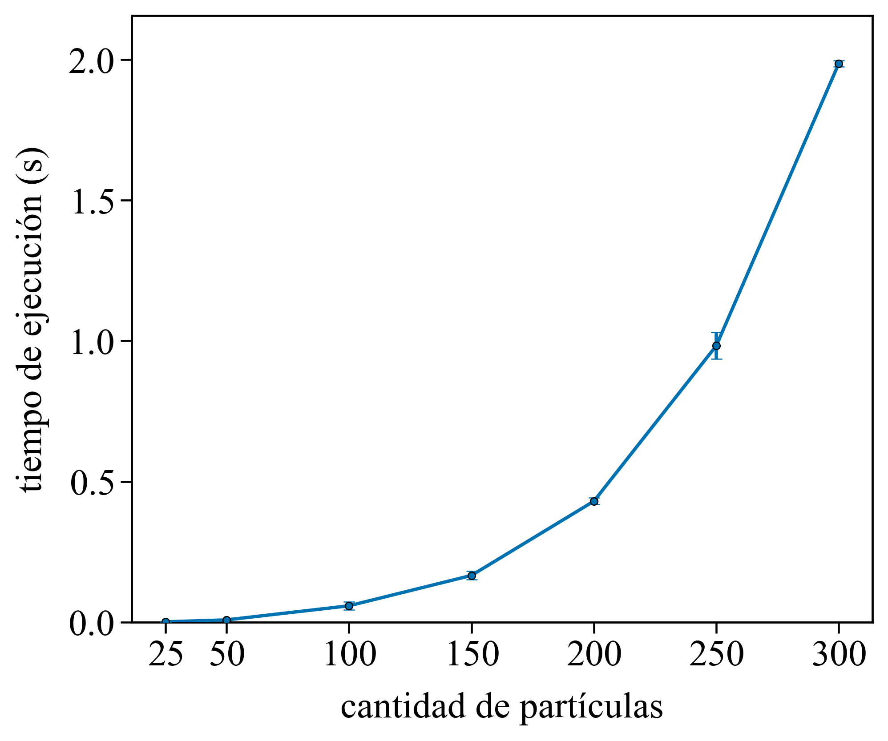
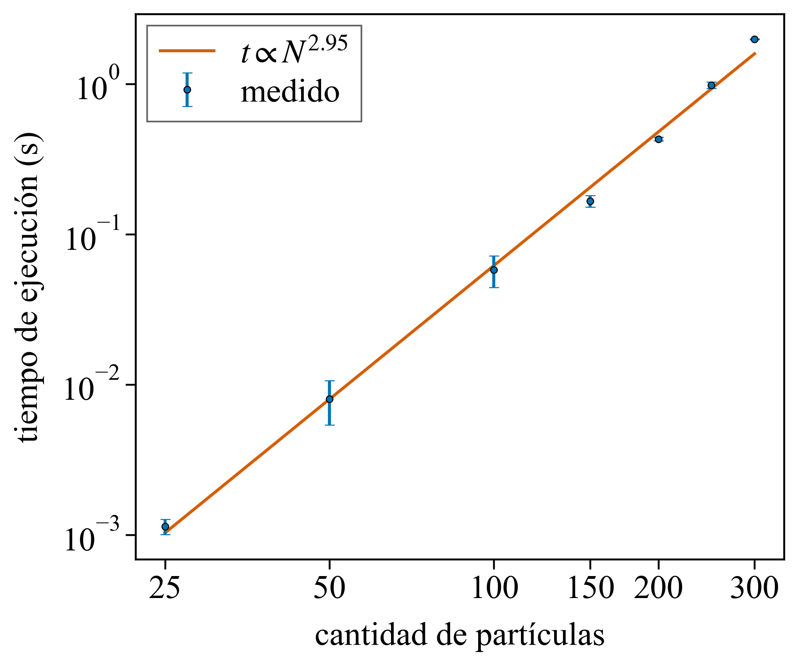
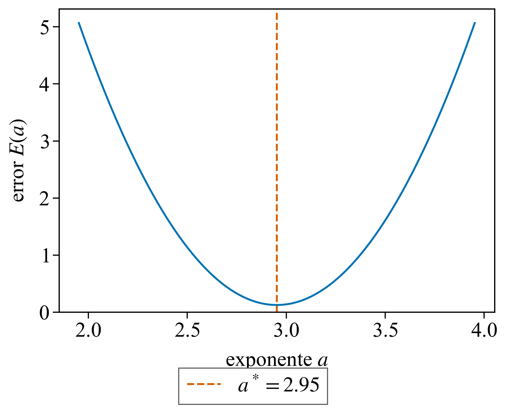
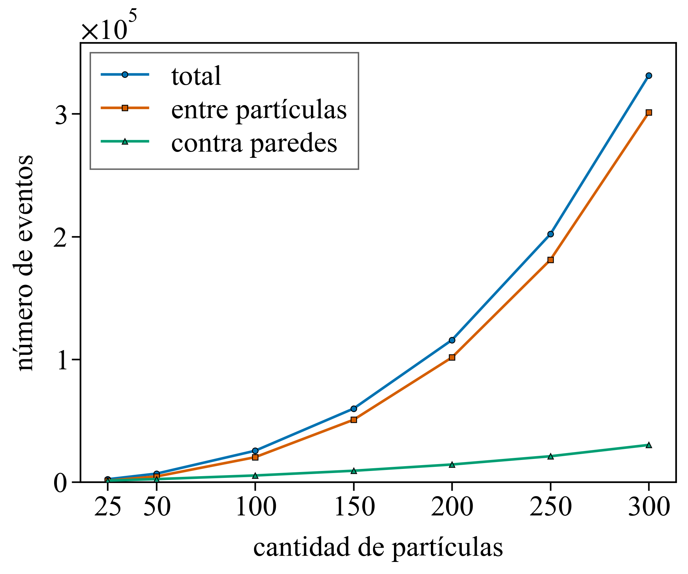
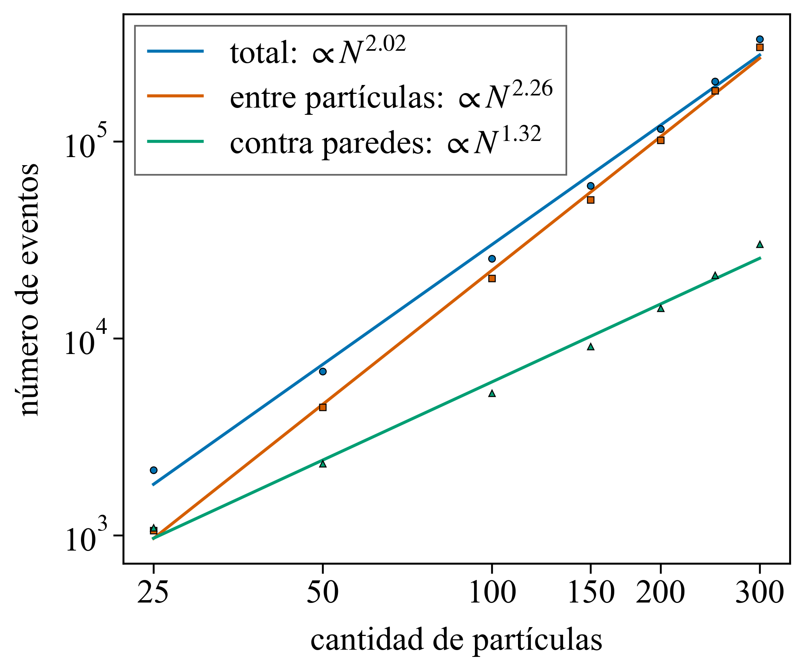
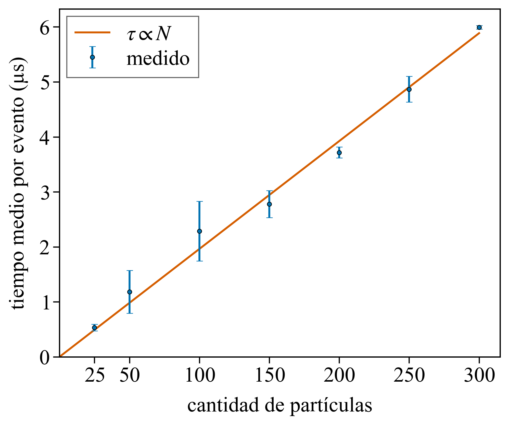

# 1.1 — Tiempo de ejecución en función de N

> Notas internas.

## Consigna

Para el sistema sin obstáculos, simular durante un tiempo absoluto fijo
tf = 30 s para distintos N, con al menos 10 realizaciones por N. Graficar el
tiempo de ejecución promedio en función de N con su desvío estándar.

## Cómo se midió

```
python python/run.py --wall data/wall/wall.txt --n 25 50 100 150 200 250 300 --reps 10 --tmax 30
python python/make.py --data data/wall
```

- Mesa sin obstáculos, tf = 30 s, N ∈ {25, 50, 100, 150, 200, 250, 300}.
- 10 realizaciones por N, semilla distinta y registrada por realización.
- **Tiempo del motor:** construcción de la cola de eventos inicial más el
  procesamiento de eventos hasta tf. Excluye la generación de la condición
  inicial y toda escritura de archivos.
- **Eventos**: colisiones entre partículas y colisiones contra paredes.
- **Tiempo por evento**: cociente entre el tiempo promedio del motor y la cantidad promedio de eventos para cada N. Incluye la construcción de la cola inicial en el numerador; no es una medición aislada del procesamiento de una colisión.

## Datos

`data/wall/runtime.txt` (promedio y desvío sobre 10 realizaciones):

| N | t (s) | desvío (s) | desvío relativo | eventos | pared | pares | µs / evento |
|---|---|---|---|---|---|---|---|
| 25  | 0.00114 | 0.00013 | 11 % | 2 143 | 1 090 | 1 054 | 0.53 |
| 50  | 0.00802 | 0.00263 | 33 % | 6 785 | 2 311 | 4 474 | 1.18 |
| 100 | 0.0581  | 0.0138  | 24 % | 25 397 | 5 256 | 20 141 | 2.29 |
| 150 | 0.166   | 0.0147  | 9 %  | 59 750 | 9 106 | 50 643 | 2.78 |
| 200 | 0.430   | 0.0117  | 2.7 % | 115 690 | 14 210 | 101 479 | 3.71 |
| 250 | 0.983   | 0.0471  | 4.8 % | 201 993 | 20 943 | 181 050 | 4.87 |
| 300 | 1.986   | 0.0109  | 0.5 % | 331 410 | 30 162 | 301 248 | 5.99 |

Desvío relativo = 100 × desvío / tiempo promedio.

Exponentes ajustados en log-log (cuadrados mínimos sobre los 7 puntos):

| magnitud | exponente |
|---|---|
| tiempo de ejecución | 2.95 |
| eventos totales | 2.02 |
| eventos entre partículas | 2.26 |
| eventos contra paredes | 1.32 |
| tiempo por evento | 0.98 |

## Figuras

### Tiempo de ejecución vs N (la figura pedida)



- Tiempo promedio aumenta en todos los valores sucesivos de N medidos: pasa de 0.00114 s para N = 25 a 1.986 s para N = 300.
- Barras de error = desvío estándar sobre 10 realizaciones. Desvío relativo es menor al 5 % para N ≥ 200.


### Ajuste de ley de potencia (Teórica 0)




Ajuste por cuadrados mínimos.
Se ajusta la función:

$$
t = cN^a
$$

Aplicando logaritmos:

$$
\log t = \log c + a\log N
$$

Para cada exponente a, se toma el valor de log c que minimiza la suma de residuos cuadrados:

$$
E(a) = \sum_{i=1}^{7}\left[\log t_i - \left(\log c(a) + a\log N_i\right)\right]^2
$$

El mínimo corresponde a a ≈ 2.95, cercano a 3. Este valor describe el ajuste sobre el intervalo N = 25 a N = 300. No se extrapola a valores de N fuera de ese intervalo.
Resultado: a ≈ 3.

### Número de eventos vs N, por tipo




- Cantidad promedio de eventos totales aumenta de 2.143 para N = 25 a 331.410 para N = 300. Ambos tipos de colisión aumentan en todos los valores sucesivos de N medidos.
- Para N = 25, las colisiones contra paredes superan ligeramente a las colisiones entre partículas. Desde N = 50, las colisiones entre partículas son mucho mas en todos los valores estudiados. Su participación en el total aumenta de aproximadamente 49 % para N = 25 a 91 % para N = 300.
- Los exponentes ajustados son 2.02 para el total, 2.26 para pares y 1.32 para paredes. Se informan por separado: el exponente del total no representa el ajuste de cada tipo de colisión ni es la suma de sus exponentes.

### Tiempo medio por evento vs N



- cociente tiempo promedio / cantidad promedio de eventos 
- aumenta de 0.53 µs para N = 25 a 5.99 µs para N = 300. 
- Ajuste de ley de potencia da un exponente de 0.93, cercano a 1.

Lineal en N y pasa por el origen: unos 20 ns por partícula por evento.

## Notas y conclusiones
- En el intervalo estudiado, el tiempo de ejecución presenta un crecimiento aproximadamente cúbico.
[Por que: Al aumentar N, aumentan tanto la cantidad de eventos como el tiempo promedio por evento. Los ajustes de ambas magnitudes dan una dependencia aproximadamente cuadrática y aproximadamente lineal, respectivamente.]
- La cantidad total de eventos (colisiones entre pares y colisiones con paredes) presenta un crecimiento aproximadamente cuadrático.
[Esto es mas por fisica: agregamos mas particulas en una mesa del mismo tam -> menor densidad -> mas colisiones entre particulas]
- Las colisiones entre partículas crecen más rápidamente que las colisiones contra paredes y representan aproximadamente el 91 % de los eventos para N = 300.
- El tiempo promedio por evento aumenta aproximadamente de forma lineal con N.
[Por implementacion, después de cada colisión se actualizan las posiciones de todas las partículas y se recalculan predicciones de las partículas involucradas contra las restantes. La cantidad de trabajo de estos recorridos aumenta con N. No se midió por separado cuánto tiempo consume cada operación.]
- El desvío relativo del tiempo es menor al 5 % para los tres mayores valores de N medidos.
[Creo que las ejecuciones mas cortas pueden ser más sensibles, en términos relativos, a variaciones del entorno de ejecución. Es una posible explicación de la mayor dispersión relativa para N pequeños; pero no esta comproabado, no creo mencionarlo nunca.]

## Optimizaciones posibles
Se puede bajar a que en vez de que el tiempo de ejecucion tenga una tendencia cubica se llegue a  N² log N.
Con: cell index y lazy positioning permitirían reducir el trabajo por evento.

Ver [How to Simulate Billiards and Similar Systems](<../../How to Simulate Billiards and Similar Systems.pdf>) y [Efficient event-driven simulations of hard spheres](<../../Efficient event-driven simulations of hard spheres.pdf>)