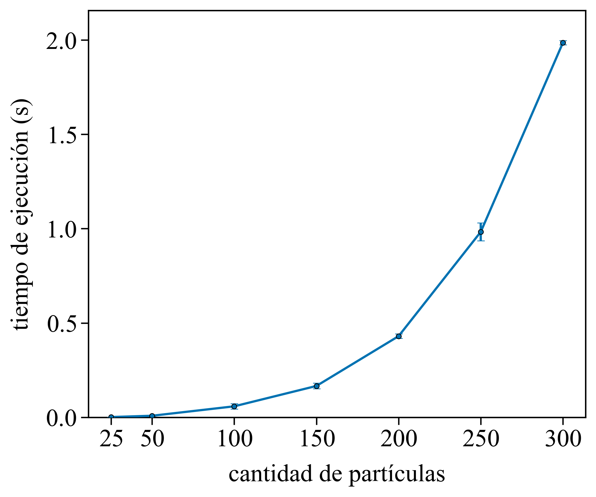
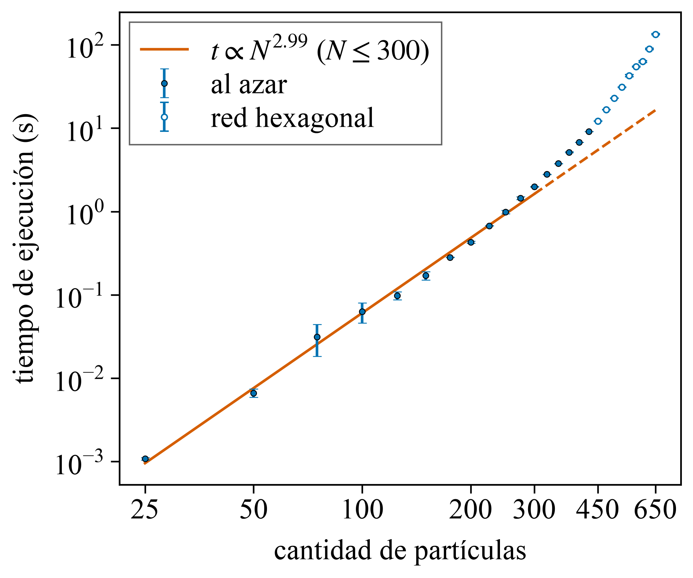
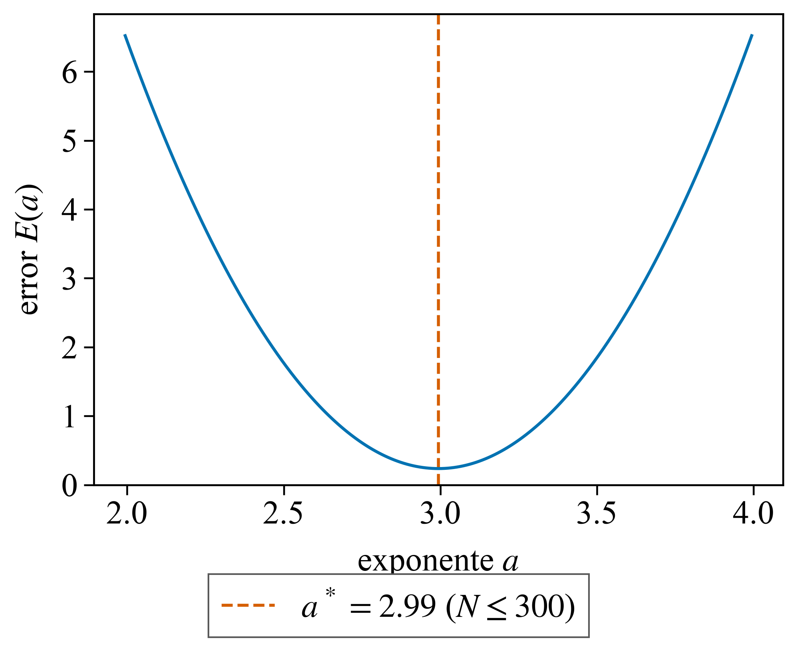
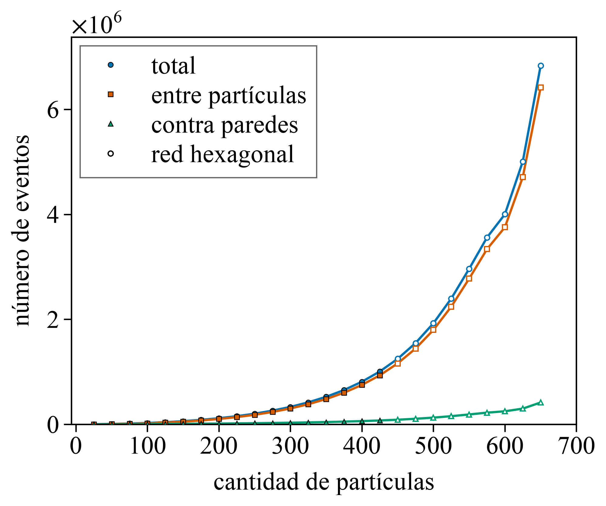
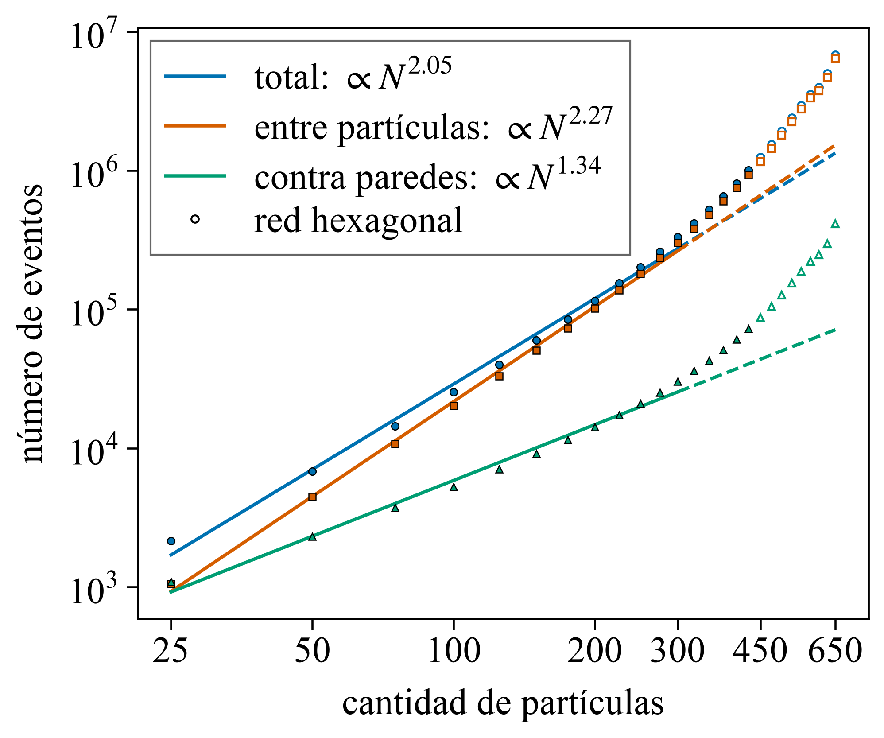
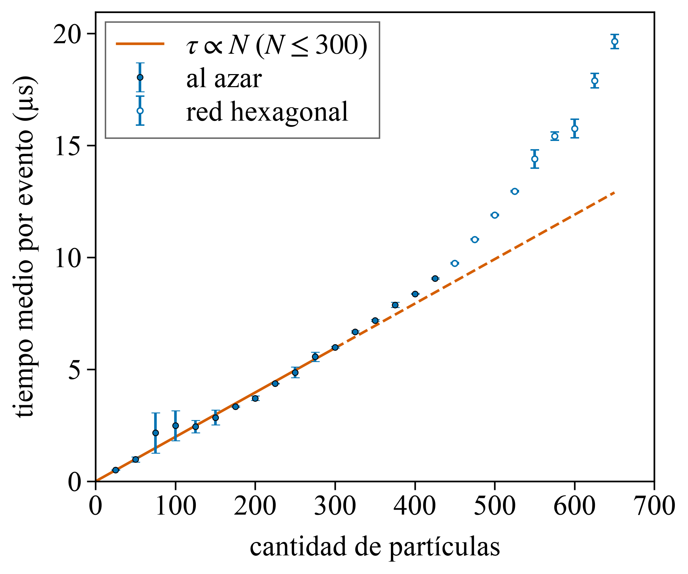

# 1.1 — Tiempo de ejecución en función de N

> Notas internas.

## Consigna

Para el sistema sin obstáculos, simular durante un tiempo absoluto fijo
tf = 30 s para distintos N, con al menos 10 realizaciones por N. Graficar el
tiempo de ejecución promedio en función de N con su desvío estándar.

## Cómo se midió
**Posiciones al azar** (muestreo por rechazo, N ≤ 425):

```
python python/run.py --wall data/wall/wall.txt --n 25 50 100 150 200 250 300 --reps 10 --tmax 30
python python/run.py --wall data/wall/wall.txt --n 75 125 175 225 275 325 350 375 400 425 --reps 10 --tmax 30
```

**Red hexagonal** (`--init hex`, N ≥ 450):

```
python python/run.py --wall data/wall_hex/wall.txt --n 450 475 500 525 550 575 600 625 650 --reps 10 --tmax 30 --init hex
python python/run.py --wall data/wall_hex/wall.txt --n 700 --reps 4 --tmax 30 --init hex
```

**Tablas y figuras:**

```
python python/make.py --data data/wall --compare-data data/wall_hex
python python/make.py --data data/wall_overlap
```

`make.py --compare-data` combina los valores de N de las dos carpetas en una única serie (`data/wall/runtime_all.txt`); los de la red hexagonal se dibujan con marcador vacío.

`run.py --wall` agrega filas al final del archivo y `make.py` agrupa por N. Para sumar valores de N (o realizaciones) alcanza con correr solo lo nuevo sobre el mismo archivo y volver a correr `make.py`. Por ejemplo, para completar N = 700 hasta 10 realizaciones sin repetir las semillas 1…4:

```
python python/run.py --wall data/wall_hex/wall.txt --n 700 --reps 6 --seed 5 --tmax 30 --init hex
python python/make.py --data data/wall --compare-data data/wall_hex
```

- Mesa sin obstáculos, tf = 30 s.
- N de 25 a 650 cada 25, más N = 700.
- 10 realizaciones por N, con semilla distinta y registrada (semillas 1…10 en cada N). Excepción: **N = 700 tiene 4 realizaciones** (semillas 1…4); cada una tarda ~11 min y no se completaron las 10.

### Tiempo medido
El tiempo del motor comprende:
- la construcción inicial de la cola de eventos;
- el procesamiento de los eventos hasta alcanzar (t_f).

No incluye:
- la generación de la condición inicial;
- la escritura de archivos.

### Definición de eventos

Se contabilizan:
- colisiones entre partículas;
- colisiones contra paredes.

### Tiempo medio por evento

Se define como

$
\tau =
\frac{\text{tiempo promedio del motor}}
{\text{cantidad promedio de eventos}}
$

El numerador incluye la construcción inicial de la cola de eventos. Por lo tanto, (\tau) no representa una medición aislada del costo computacional de procesar una colisión.

### Tiempo medio entre choques por partícula

Se define como

$
t_c =
\frac{t_f N}
{2N_{\mathrm{pares}} + N_{\mathrm{paredes}}}
$

Cada colisión entre dos partículas cuenta para dos partículas, mientras que una colisión contra una pared afecta a una sola.

### Límite del muestreo al azar

El generador aleatorio ubica las partículas de a una utilizando muestreo por rechazo. Cada candidato que se solapa con una partícula ya colocada se descarta, con un máximo de 100 000 intentos por partícula.

Se verificó el límite mediante:
```
for n in 350 400 425 450 475 500; do ./build/EventDrivenSim --raw -N $n -seed 1 -tmax 0.01 -k 0; done
```

| N | resultado |
|---|---|
| 350, 400, 425 | ok |
| 450, 475, 500 | falla: no ubica la partícula 434 (fracción ocupada 0.511) |

Para $N \ge 450$, el generador falla al intentar ubicar aproximadamente la partícula 434, correspondiente a una fracción ocupada cercana a 0.51.
Por lo tanto, con el procedimiento de posiciones aleatorias utilizado, el límite práctico se encuentra alrededor de $N \approx 433$

Para valores mayores se utilizó una red hexagonal inicial.

La red hexagonal se construye utilizando el mayor espaciado que permite ubicar las $N$ partículas dentro de la mesa y distribuyendo uniformemente las vacantes. Las velocidades siguen siendo aleatorias: todas las partículas tienen módulo $v_$), pero el ángulo depende de la semilla.

Por lo tanto, las diferentes realizaciones continúan siendo dinámicamente distintas.

La red hexagonal permite ubicar como máximo 737 partículas en esta geometría.

### ¿La condición inicial cambia el tiempo?

Para combinar los resultados obtenidos con las dos inicializaciones es necesario verificar que comenzar desde una configuración ordenada no cambie de manera significativa las magnitudes medidas.

Se realizaron corridas con ambos tipos de condición inicial para (N=200), (300) y (425), utilizando 10 realizaciones en cada caso y el mismo build Release.

| N | al azar (s) | red hexagonal (s) | diferencia | eventos al azar | eventos red |
|---|---|---|---|---|---|
| 200 | 0.430 ± 0.012 | 0.440 ± 0.003 | +2.3 % | 115 690 | 115 876 |
| 300 | 1.986 ± 0.011 | 1.985 ± 0.016 | −0.05 % | 331 410 | 331 374 |
| 425 | 9.117 ± 0.033 | 9.005 ± 0.095 | −1.2 % | 1 005 244 | 1 004 820 |

La cantidad de eventos difiere menos de 0.2 % entre ambas inicializaciones y el tiempo promedio difiere como máximo 2.3 %.
Estas diferencias son pequeñas frente al crecimiento observado al aumentar (N). Por ejemplo, entre varios valores consecutivos de (N), el tiempo de ejecución cambia decenas de puntos porcentuales.

Por lo tanto, para los valores en los que ambas condiciones iniciales pueden compararse, no se observa una dependencia relevante del tiempo de ejecución o de la cantidad de eventos respecto de la configuración inicial.

La interpretación es que la red inicial introduce únicamente un transitorio corto respecto de los 30 s simulados, siempre que el sistema tenga suficiente movilidad para perder rápidamente el orden inicial.

## Datos

`data/wall/runtime_all.txt` (promedio y desvío entre realizaciones; ♦ = red hexagonal):

| N | ocupación | t (s) | desvío (s) | desvío relativo | eventos | pared | pares | µs / evento | t_c (ms) |
|---|---|---|---|---|---|---|---|---|---|
| 25  | 0.029 | 0.00108 | 0.000034 | 3.2 % | 2 143 | 1 090 | 1 054 | 0.50 | 235 |
| 50  | 0.059 | 0.00663 | 0.00076 | 11 % | 6 785 | 2 311 | 4 474 | 0.98 | 133 |
| 75  | 0.088 | 0.0312 | 0.0129 | 41 % | 14 415 | 3 714 | 10 701 | 2.16 | 89.6 |
| 100 | 0.118 | 0.0631 | 0.0170 | 27 % | 25 397 | 5 256 | 20 141 | 2.49 | 65.9 |
| 125 | 0.147 | 0.0981 | 0.0110 | 11 % | 40 160 | 7 057 | 33 103 | 2.44 | 51.2 |
| 150 | 0.177 | 0.170 | 0.0200 | 12 % | 59 750 | 9 106 | 50 643 | 2.85 | 40.8 |
| 175 | 0.206 | 0.282 | 0.0023 | 0.81 % | 84 534 | 11 481 | 73 052 | 3.34 | 33.3 |
| 200 | 0.236 | 0.430 | 0.0117 | 2.7 % | 115 690 | 14 210 | 101 479 | 3.71 | 27.6 |
| 225 | 0.265 | 0.675 | 0.0034 | 0.50 % | 154 450 | 17 333 | 137 117 | 4.37 | 23.2 |
| 250 | 0.295 | 0.983 | 0.0471 | 4.8 % | 201 993 | 20 943 | 181 050 | 4.87 | 19.6 |
| 275 | 0.324 | 1.448 | 0.0533 | 3.7 % | 260 133 | 25 224 | 234 908 | 5.57 | 16.7 |
| 300 | 0.354 | 1.986 | 0.0109 | 0.55 % | 331 410 | 30 162 | 301 248 | 5.99 | 14.2 |
| 325 | 0.383 | 2.794 | 0.0189 | 0.68 % | 418 230 | 35 973 | 382 257 | 6.68 | 12.2 |
| 350 | 0.413 | 3.762 | 0.0201 | 0.53 % | 523 505 | 42 855 | 480 650 | 7.19 | 10.5 |
| 375 | 0.442 | 5.143 | 0.0711 | 1.4 % | 652 229 | 51 115 | 601 114 | 7.89 | 8.98 |
| 400 | 0.472 | 6.792 | 0.0164 | 0.24 % | 810 746 | 60 902 | 749 844 | 8.38 | 7.69 |
| 425 | 0.501 | 9.117 | 0.0325 | 0.36 % | 1 005 244 | 72 820 | 932 424 | 9.07 | 6.58 |
| 450 ♦ | 0.531 | 12.14 | 0.0341 | 0.28 % | 1 246 654 | 87 198 | 1 159 456 | 9.74 | 5.61 |
| 475 ♦ | 0.560 | 16.71 | 0.0300 | 0.18 % | 1 546 600 | 105 045 | 1 441 555 | 10.8 | 4.77 |
| 500 ♦ | 0.590 | 22.88 | 0.0620 | 0.27 % | 1 924 180 | 127 252 | 1 796 928 | 11.9 | 4.03 |
| 525 ♦ | 0.619 | 31.02 | 0.0721 | 0.23 % | 2 395 523 | 154 593 | 2 240 930 | 12.9 | 3.40 |
| 550 ♦ | 0.648 | 42.64 | 1.22 | 2.9 % | 2 961 584 | 187 368 | 2 774 216 | 14.4 | 2.88 |
| 575 ♦ | 0.678 | 54.88 | 0.662 | 1.2 % | 3 558 706 | 222 035 | 3 336 671 | 15.4 | 2.50 |
| 600 ♦ | 0.707 | 63.03 | 1.67 | 2.6 % | 4 000 560 | 247 776 | 3 752 784 | 15.8 | 2.32 |
| 625 ♦ | 0.737 | 89.55 | 1.62 | 1.8 % | 5 005 135 | 298 430 | 4 706 705 | 17.9 | 1.93 |
| 650 ♦ | 0.766 | 134.2 | 2.17 | 1.6 % | 6 832 243 | 415 493 | 6 416 750 | 19.6 | 1.47 |
| 700 ♦ (4 realizaciones) | 0.825 | 675.8 | 14.2 | 2.1 % | 28 016 022 | 1 672 360 | 26 343 662 | 24.1 | 0.386 |

- Desvío relativo = 100 × desvío / tiempo promedio.
- Ocupación = N π r² / (L W).

### Exponentes ajustados en log-log con los 12 puntos de N ≤ 300:

| magnitud | exponente |
|---|---|
| tiempo de ejecución | 2.99 |
| eventos totales | 2.05 |
| eventos entre partículas | 2.27 |
| eventos contra paredes | 1.34 |
| tiempo por evento | 0.95 |

El resultado central en este rango es:
$
T(N)\propto N^{2.99}\approx N^3.
$

Además,

$
E(N)\propto N^{2.05},
$

y

$
\tau(N)\propto N^{0.95}.
$

Dado que

$
T(N)=E(N)\tau(N),
$

los exponentes observados son consistentes entre sí:

$
N^{2.05}N^{0.95}\approx N^3.
$

Esto permite separar el crecimiento del tiempo total en dos efectos:
- aumenta la cantidad de eventos procesados;
- aumenta el costo computacional promedio asociado a cada evento.

## Figuras

Todas las figuras muestran una sola serie de N = 25 a 700; los marcadores vacíos son los N que arrancan de la red hexagonal. Todos los ajustes usan solo **N ≤ 300**: la recta ajustada se dibuja continua dentro de ese rango y punteada fuera de él, para visualizar cuánto se apartan los datos de la extrapolación. El rango del ajuste se cambia con `make.py --fit-max-n`.

### Tiempo de ejecución vs N



- El tiempo promedio crece en todos los N medidos: de 0.00108 s para N = 25 a 63.0 s para N = 600, 134 s para N = 650 y 676 s para N = 700.
- Las barras de error son el desvío estándar entre realizaciones (4 en N = 700). El desvío relativo es grande para N ≤ 150 (hasta 41 %, en corridas de milisegundos), menor al 1.5 % entre N = 300 y 525, y entre 1.2 % y 2.9 % desde N = 550.

### Ajuste de ley de potencia (Teórica 0)




Se ajusta por cuadrados mínimos la función

$$
t = cN^a
$$

Aplicando logaritmos:

$$
\log t = \log c + a\log N
$$

Para cada exponente a, se toma el valor de log c que minimiza la suma de residuos cuadrados sobre los 12 puntos con N ≤ 300:

$$
E(a) = \sum_{i=1}^{12}\left[\log t_i - \left(\log c(a) + a\log N_i\right)\right]^2
$$

El mínimo está en a ≈ 2.99. Resultado: t ≈ 6.22·10⁻⁸ s · N^2.99, o sea a ≈ 3 en el régimen diluido.

Más allá de N = 300 los puntos quedan por encima de la extensión punteada, y cada vez más lejos:

| N | 350 | 400 | 450 | 500 | 550 | 600 | 650 | 700 |
|---|---|---|---|---|---|---|---|---|
| t medido / t ajustado | 1.46 | 1.77 | 2.22 | 3.06 | 4.28 | 4.88 | 8.18 | 33 |

**Por qué N ≤ 300.** Se ajustó t = cN^a con N ≤ N_c para distintos N_c, y en cada caso se agregó un término cuadrático en log-log (log t = b₀ + b₁ log N + b₂ log² N). Si una sola ley de potencia alcanza, b₂ es compatible con cero; si la curva se dobla, b₂ es significativamente positivo:

| N_c | puntos | a | b₂ / error(b₂) |
|---|---|---|---|
| 250 | 10 | 2.93 ± 0.06 | 0.7 |
| 300 | 12 | 2.99 ± 0.06 | 1.8 |
| 325 | 13 | 3.03 ± 0.06 | 2.5 |
| 400 | 16 | 3.14 ± 0.07 | 4.4 |
| 500 | 20 | 3.30 ± 0.09 | 6.6 |
| 700 | 27 | 3.71 ± 0.15 | 6.8 |

N = 300 es el mayor N_c para el que la curvatura no es significativa (|b₂| < 2 errores, ~95 %). Desde N_c = 325 lo es, y el exponente ajustado no se estabiliza: sube con cada punto que se agrega (2.99 → 3.71). O sea, una ley de potencia describe los datos hasta N = 300 (ocupación 0.35) y deja de describirlos después. El corte sale de los datos, no se elige a mano.

El exponente local entre N consecutivos, log(t₂/t₁) / log(N₂/N₁), es ~3 hasta N = 300 (entre 2 y 4 por el ruido de los N chicos), sube a 4–5 entre 300 y 450, a ~6 entre 450 y 550, a 9–10 entre 600 y 650, y a ~22 entre 650 y 700: pasar de 650 a 700 partículas (+8 %) multiplica el tiempo por 5. El tramo 575 → 600 da 3.3, fuera de la tendencia; esos dos puntos tienen desvíos de 1–3 %. Una sola ley de potencia no describe todo el rango, por eso el ajuste se restringe a N ≤ 300.

### Número de eventos vs N, por tipo




- La cantidad promedio de eventos crece de 2 143 para N = 25 a 4.0 millones para N = 600 y 28 millones para N = 700. Los dos tipos de colisión crecen en todos los N medidos.
- Para N = 25 las colisiones contra paredes superan levemente a las colisiones entre partículas. Desde N = 50 predominan las colisiones entre partículas: son el 49 % del total para N = 25, el 91 % para N = 300 y el 94 % desde N = 600.
- Exponentes ajustados con N ≤ 300: 2.05 para el total, 2.27 para pares y 1.34 para paredes. Se informan por separado: el exponente del total no es el ajuste de cada tipo ni la suma de sus exponentes.
- Por encima de N = 300 los eventos también quedan por encima de la extensión. El exponente local de los eventos totales pasa de ~2 (N ≤ 150) a ~4.5 (N ≈ 500–550) y a ~19 entre 650 y 700.

### Tiempo medio por evento vs N



- Es el cociente entre el tiempo promedio y la cantidad promedio de eventos.
- Crece de 0.50 µs para N = 25 a 5.99 µs para N = 300, 15.8 µs para N = 600 y 24.1 µs para N = 700.
- Con N ≤ 300, el modelo τ = kN da k ≈ 19.8 ns por partícula y por evento; el ajuste de ley de potencia da exponente 0.95, cercano a 1.
- Por encima de N = 300 el costo por evento queda por encima de kN: 3.5 % más en N = 350, 20 % más en N = 500, 32 % más en N = 600 y 74 % más en N = 700.

## Notas y conclusiones

- En el régimen diluido (N ≤ 300, ocupación ≤ 0.35) el tiempo de ejecución crece de forma aproximadamente cúbica: t ∝ N^2.99.
[Por qué: aumentan tanto la cantidad de eventos (~N²) como el tiempo por evento (~N).]
- La cantidad de eventos crece aproximadamente como N² en ese rango, con los choques entre pares creciendo más rápido que los choques contra paredes.
[Es física: más partículas en la misma mesa → más densidad → más choques entre partículas.]
- El tiempo por evento crece aproximadamente de forma lineal con N (~20 ns por partícula y por evento).
[Por implementación: después de cada choque se avanzan las N partículas y se recalculan las predicciones de las que chocaron contra las demás.]
- Por encima de N = 300 el tiempo crece mucho más rápido que N³: en N = 600 es 4.9 veces lo que predice la ley ajustada, en N = 650 8 veces y en N = 700 33 veces. Entre 650 y 700 partículas el tiempo se multiplica por 5.
[La mayor parte viene de los eventos: la cantidad de choques por segundo simulado crece mucho más rápido que N² cuando la mesa se llena (×4.1 entre 650 y 700). El tiempo por evento también se aparta de kN (+74 % en N = 700), pero en menor medida. No se midió por separado a qué se debe esa parte.]
- El tiempo medio entre choques por partícula baja de 235 ms (N = 25) a 14 ms (N = 300), 2.3 ms (N = 600) y 0.39 ms (N = 700).
[Es el t_c → 0 de la teórica (sección 3): a medida que la mesa se llena, cada partícula queda encerrada por sus vecinas, choca cada vez más seguido y la simulación hace cada vez más eventos por segundo simulado. El límite es del paradigma dirigido por eventos (densidad media-baja), no del código.]
- El desvío relativo es menor al 1.5 % entre N = 300 y 525; desde N = 550 queda entre 1.2 % y 2.9 %.
[No se investigó a qué se debe. Pueden ser variaciones del entorno de ejecución en corridas de 1 a 11 minutos, pero no está comprobado.]
- En N = 700 la red inicial no se desordena en 5 s simulados (animación en `data/anim_1.1/n700.mp4`). En N = 500 y 600 sí. El salto del tiempo entre 650 y 700 coincide con ese cambio: las partículas quedan encerradas por sus vecinas y chocan contra ellas todo el tiempo sin moverse de lugar.
- N = 700 tiene 4 realizaciones en lugar de 10: cada una tarda ~11 min. El desvío entre esas 4 es 2.1 %, chico al lado del salto respecto de N = 650.
- Arrancar de la red hexagonal no cambia el tiempo ni los eventos respecto del arranque al azar (N = 200, 300, 425), así que la curva es una sola.

## Optimizaciones posibles

Se puede bajar el crecimiento de cúbico a N² log N con:

- **cell index**, para no predecir choques contra todas las partículas;
- **lazy positioning**, para no avanzar las N posiciones en cada evento.

Esto reduce el trabajo por evento. No cambia la cantidad de eventos, que es física.

Ver [How to Simulate Billiards and Similar Systems](<../../How to Simulate Billiards and Similar Systems.pdf>) y [Efficient event-driven simulations of hard spheres](<../../Efficient event-driven simulations of hard spheres.pdf>)
