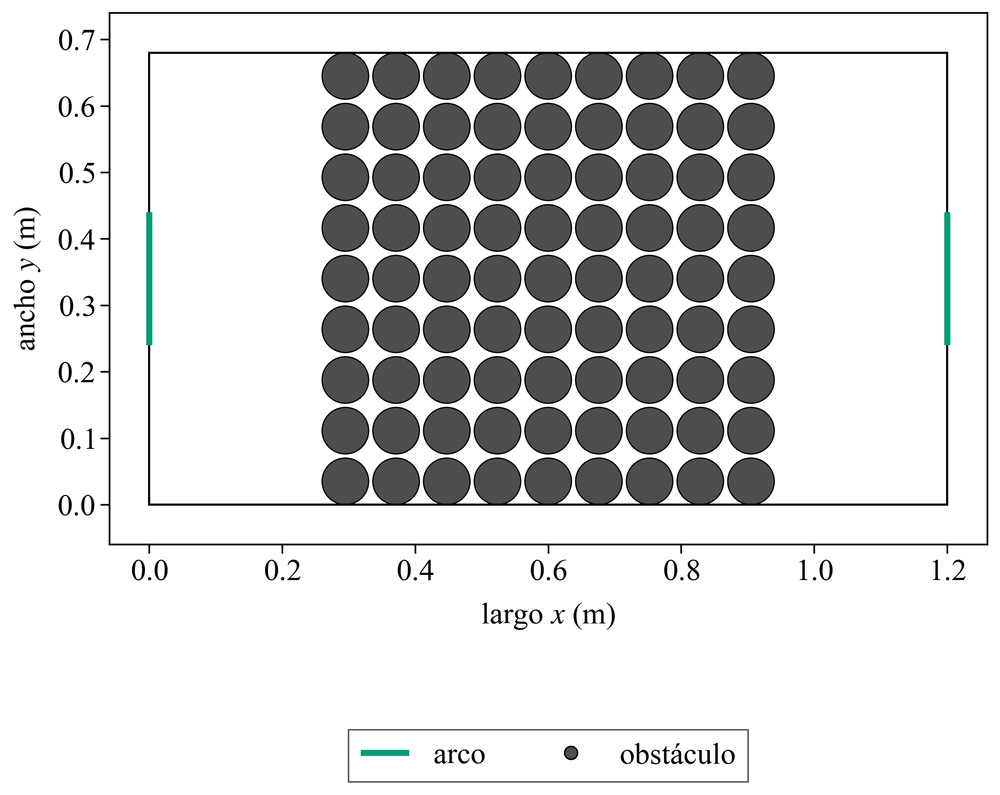
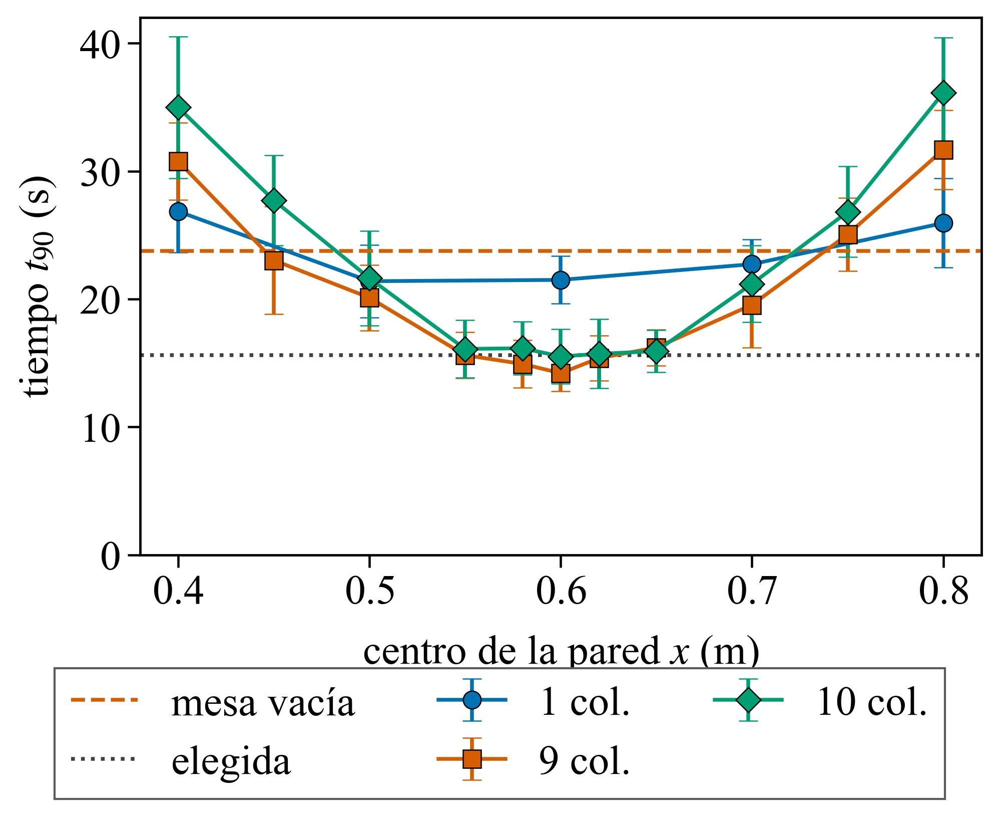
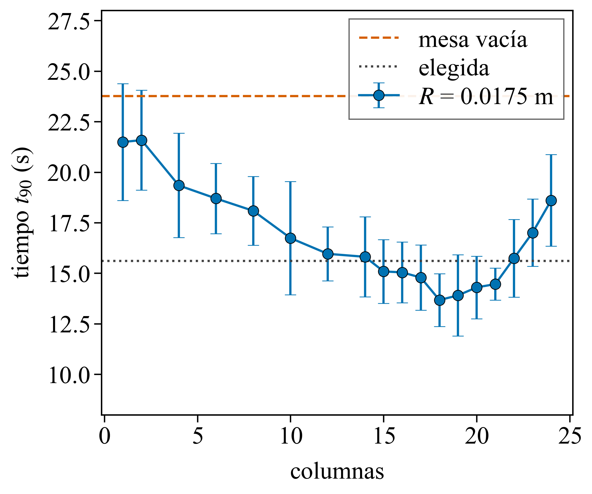

# 1.2 — Configuración que minimiza ⟨t90⟩

> Notas internas.

## Consigna

Con N = 100, encontrar la configuración de obstáculos que minimiza ⟨t90⟩ y
justificar cómo se la encontró. Los obstáculos cumplen K > 0, están enteros en
la mesa, no se solapan y tienen Rk ≥ r. Reportar ⟨t90⟩ con su desvío, con al
menos 5 realizaciones, y comparar contra la mesa vacía.

## Cómo se midió

```
python python/ga.py --outdir data/ga/full --pop 32 --gens 20 --reps 12 --jobs 8 --seed 501 --seed-config configs/ga_best.txt --exe build/EventDrivenSim.exe
python python/run.py --exe build/EventDrivenSim.exe --outdir data/runs/1.2/empty_search --reps 12 --seed 501 --k 0 --tmax 100 --jobs 4 --preview none
python python/plotters/plot_layout.py --obstacles configs/ga_best.txt --output docs/results/1.2/elegida.png
python python/plotters/plot_t90.py --input docs/results/1.2/t90_generacion.txt --output docs/results/1.2/t90_generacion.png --xlabel "generación" --empty 21.3247 2.8559
```

- **Parámetros fijos:** N = 100, v0 = 1 m/s, r = 0.0175 m, m = 0.025 kg, L = 1.20 m, W = 0.68 m, d = 0.20 m, tmax = 100 s.
- **Individuo:** lista de discos (xk, yk, Rk). Población 32, 20 generaciones. La población inicial incluye embudos, rieles, un obstáculo grande sobre el eje longitudinal y la configuración de la corrida anterior.
- **Búsqueda:** 12 realizaciones por individuo, semillas 501 a 512, las mismas para todos. Si el mejor no mejora durante 5 generaciones la búsqueda corta; en esta corrida siguió hasta la 20.
- **Confirmación:** semillas 601 a 612, que no entraron en la búsqueda. Ese es el ⟨t90⟩ que se reporta.
- **Barras de error:** desvío estándar muestral de las realizaciones, igual que en el 1.1.

## Datos

Configuración elegida, `configs/ga_best.txt`. Cada fila es un obstáculo: xk, yk, Rk, en metros.

| obstáculo | xk (m) | yk (m) | Rk (m) |
|---|---|---|---|
| 1 | 0.5900 | 0.3400 | 0.3400 |

El disco está entero en la mesa: el centro queda sobre el eje longitudinal y el radio es la mitad del ancho, así que toca las dos paredes largas. Rk ≥ r. Con un solo obstáculo no hay solapes. En las 12 semillas de confirmación el generador ubicó las 100 partículas.

⟨t90⟩ sobre esas 12 semillas:

| configuración | ⟨t90⟩ (s) | desvío (s) | llegaron a Fu = 0.9 |
|---|---|---|---|
| elegida | 15.61 | 2.47 | 12 / 12 |
| mesa vacía | 23.76 | 3.22 | 12 / 12 |

Mejor individuo de cada generación de la búsqueda (semillas 501 a 512). La mesa vacía, con esas mismas semillas, da 21.32 ± 2.86 s y también llega a Fu = 0.9 en las 12.

| generación | K | ⟨t90⟩ (s) | desvío (s) |
|---|---|---|---|
| 1  | 1 | 18.12 | 1.42 |
| 2  | 1 | 18.11 | 1.69 |
| 3  | 2 | 17.92 | 2.26 |
| 4  | 2 | 17.66 | 1.09 |
| 5  | 2 | 17.66 | 1.09 |
| 6  | 2 | 17.66 | 1.09 |
| 7  | 2 | 17.66 | 1.09 |
| 8  | 2 | 17.64 | 1.94 |
| 9  | 1 | 17.32 | 2.08 |
| 10 | 1 | 17.32 | 2.08 |
| 11 | 3 | 16.97 | 1.44 |
| 12 | 3 | 16.97 | 1.44 |
| 13 | 3 | 16.80 | 1.13 |
| 14 | 3 | 16.80 | 1.13 |
| 15 | 3 | 16.80 | 1.13 |
| 16 | 3 | 16.80 | 1.13 |
| 17 | 1 | 16.25 | 1.52 |
| 18 | 1 | 16.25 | 1.52 |
| 19 | 1 | 16.11 | 1.85 |
| 20 | 1 | 16.03 | 1.63 |

## Figuras

### Configuración elegida


- Un disco de radio 0.34 m en (0.59 m, 0.34 m). Ocupa todo el ancho y toca las dos paredes largas. Los segmentos verdes son los arcos.

### Mesas comparadas, con su ⟨t90⟩


Semillas 601 a 612. De izquierda a derecha:

- Elegida, 15.61 ± 2.47 s.
- El mismo disco centrado en x = 0.60 m, 16.96 ± 1.99 s.
- Disco de radio 0.22 m en (0.60 m, 0.34 m), 19.72 ± 3.19 s.
- Embudo, 21.70 ± 3.04 s.
- Mesa vacía, 23.76 ± 3.22 s.

### ⟨t90⟩ de la búsqueda frente a la mesa vacía


- El mejor ⟨t90⟩ baja de 18.12 s en la generación 1 a 16.03 s en la generación 20.
- La línea naranja es la mesa vacía en las semillas de la búsqueda (21.32 s). La banda y las barras son el desvío de las 12 realizaciones, no el error de la media.
- El 16.03 s no es el resultado que se informa: usa las semillas con las que se eligió. En las semillas de confirmación el ⟨t90⟩ de esa configuración es 15.61 ± 2.47 s, y el de la mesa vacía es 23.76 ± 3.22 s.

### Pared de círculos

Cada círculo tiene radio 0.035 m. Una columna tapa el alto: el primero toca la pared de abajo y el último la de arriba. El hueco entre círculos, en vertical y entre columnas, es 6.3 mm, menos que el diámetro de una partícula (35 mm). El ancho se agranda agregando columnas con ese mismo hueco, de 1 a 10: 1 columna mide 0.07 m y 10 columnas miden 0.756 m. El centro de la pared se movió de x = 0.40 m a x = 0.80 m. Semillas 601 a 612.

```
python python/pared.py --outdir data/runs/1.2/pared_cols --jobs 8 --reps 12 --seed 601 --exe build/EventDrivenSim.exe
```



La de menor ⟨t90⟩ en la grilla: 9 columnas, ancho 0.68 m, centro en x = 0.60 m.



La figura muestra 1, 9 y 10 columnas. El resto del barrido está en `pared_t90.txt`.

Las animaciones de esa figura, más la del círculo elegido, están en `data/runs/1.2/anim/`: `elegida.gif`, `pared_1.gif`, `pared_9.gif` y `pared_10.gif`. Semilla 601, 30 s, un cuadro cada 300 colisiones, 10 fps. El recuadro es Fu(t). En esa semilla el t90 es 17.13 s (elegida), 23.09 s (1 columna), 13.70 s (9) y 15.88 s (10).

- Para 8, 9 y 10 columnas se midieron también los centros 0.45, 0.55, 0.58, 0.62, 0.65 y 0.75 m. El mínimo sigue en x = 0.60 m: mover la pared de 9 columnas a 0.58 m sube el ⟨t90⟩ a 14.93 ± 1.85 s, y a 0.62 m lo sube a 15.39 ± 1.75 s. En x = 0.45 m y x = 0.75 m queda en 23–27 s.
- Agregar columnas en el centro baja el tiempo hasta 9: 21.50 s con 1, 16.27 s con 5, 15.05 s con 6, 14.47 s con 8 y 14.21 ± 1.41 s con 9. Con 10 vuelve a 15.52 ± 2.14 s.
- Esa mejor pared queda debajo de la mesa vacía (23.76 ± 3.22 s) y también debajo de la elegida (15.61 ± 2.47 s). Las barras de la pared de 9 columnas y de la elegida se solapan.

El radio queda fijo en el mínimo de la consigna, Rk = r = 0.0175 m. El hueco es 0.8 mm. Lo que se varía es la cantidad de columnas, de 1 a 24, con centro en x = 0.60 m y las semillas 601 a 612. Con 26 columnas el generador no ubica las 100 partículas (fracción ocupada 0.69).

```
python python/pared.py --radius 0.0175 --columns 1 2 4 6 8 10 12 14 15 23 24 --centers 0.60 --outdir data/runs/1.2/pared_cols_rmin --jobs 8 --reps 12 --seed 601 --exe build/EventDrivenSim.exe
python python/pared.py --radius 0.0175 --columns 18 19 20 21 22 --centers 0.60 --outdir data/runs/1.2/pared_rmin --jobs 8 --reps 12 --seed 601 --exe build/EventDrivenSim.exe
python python/pared.py --radius 0.0175 --columns 16 17 --centers 0.60 --outdir data/runs/1.2/pared_rmin_lo --jobs 8 --reps 12 --seed 601 --exe build/EventDrivenSim.exe
python python/plotters/plot_layout.py --obstacles data/runs/1.2/pared_rmin/r0.0175_c18_x0.60.txt --output docs/results/1.2/pared_18.png
```




- El mínimo es 13.67 ± 1.31 s, con 18 columnas (ancho 0.644 m). A los lados: 14.79 ± 1.62 s con 17 y 13.91 ± 2.01 s con 19. Con 1 columna da 21.49 ± 2.89 s y con 24 vuelve a 18.61 ± 2.27 s. La animación está en `data/runs/1.2/anim/pared_18.gif` (semilla 601, t90 = 12.01 s).
- 13.67 + 1.31 = 14.98 s y 15.61 − 2.47 = 13.14 s: las barras con la elegida se siguen solapando.

## Notas y conclusiones

- La configuración elegida tiene ⟨t90⟩ = 15.61 ± 2.47 s, frente a 23.76 ± 3.22 s de la mesa vacía, en 12 realizaciones que no participaron de la búsqueda. Las 12 llegan a Fu = 0.9.
- En la búsqueda el mejor valor sigue bajando hasta la generación 20. El disco grande sobre el eje longitudinal le gana a los layouts de dos y tres discos que fueron mejores en generaciones intermedias.
- Las barras de la confirmación no se solapan: 15.61 + 2.47 = 18.08 s y 23.76 − 3.22 = 20.54 s.
- La pared de círculos de radio 0.035 m, en las mismas semillas 601 a 612, tiene su mínimo en 14.21 ± 1.41 s, con 9 columnas (ancho 0.68 m) y centro en x = 0.60 m. Con el radio mínimo de la consigna (0.0175 m) baja a 13.67 ± 1.31 s, con 18 columnas y ancho 0.644 m. En ambos casos la media queda debajo de la elegida y las barras se solapan.
