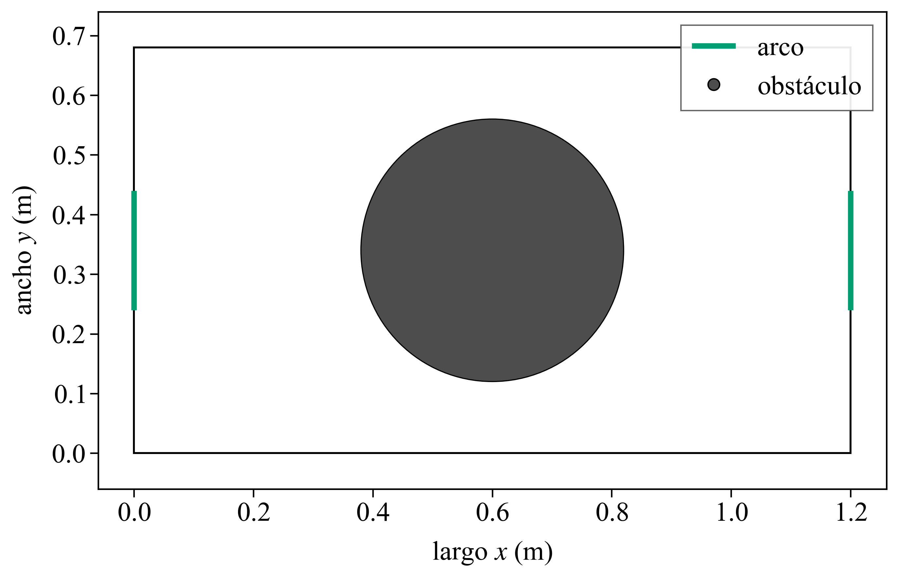
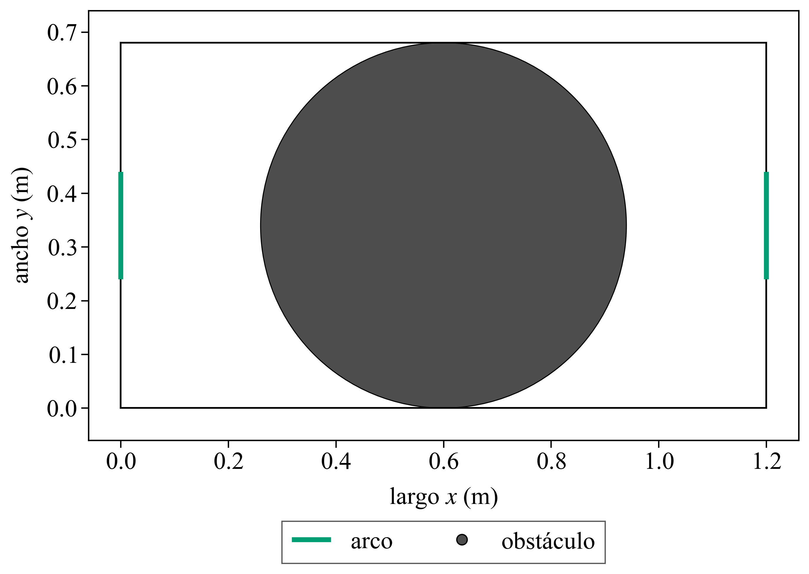
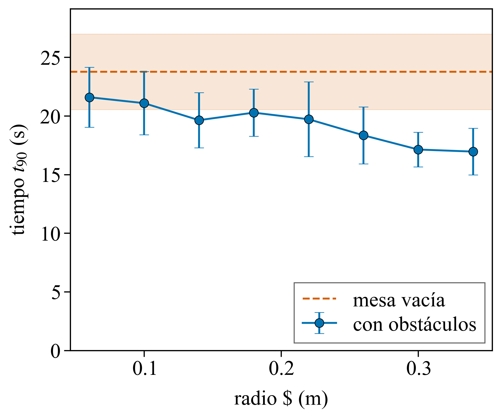
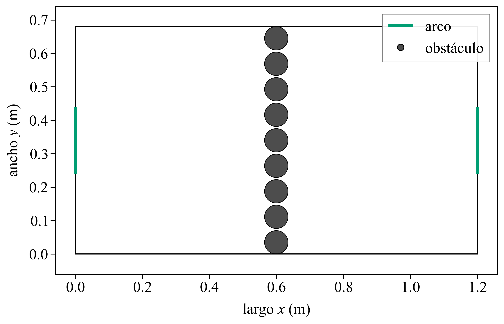
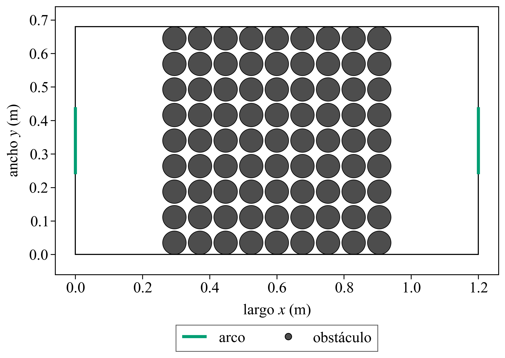
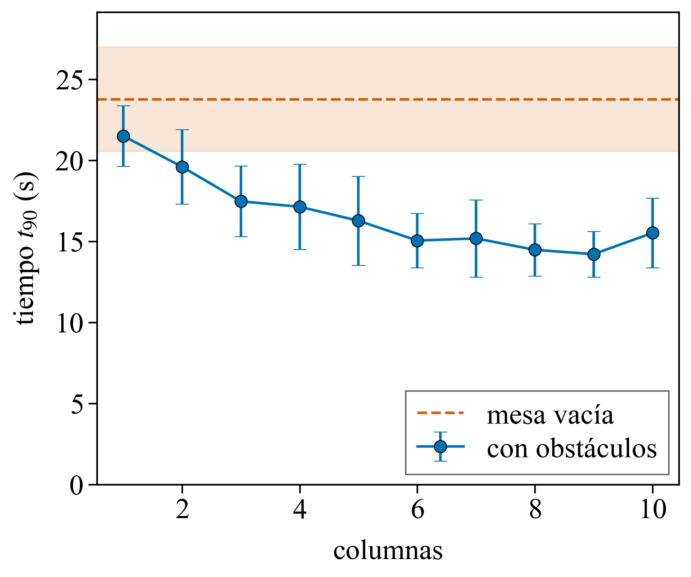

# 1.2 — Configuración que minimiza ⟨t90⟩

> Notas internas.

## Consigna

Con N = 100, encontrar la configuración de obstáculos que minimiza ⟨t90⟩ y
justificar cómo se la encontró. Los obstáculos cumplen K > 0, están enteros en
la mesa, no se solapan y tienen Rk ≥ r. Reportar ⟨t90⟩ con su desvío, con al
menos 5 realizaciones, y comparar contra la mesa vacía.

## Cómo se midió

```
python python/plotters/plot_layout.py --obstacles configs/disco_grande.txt --output docs/results/1.2/disco_022.png
python python/plotters/plot_layout.py --obstacles data/runs/1.2/disco_radio/r0.34_centro.txt --output docs/results/1.2/disco_034.png
python python/plotters/plot_t90.py --input docs/results/1.2/disco_radio.txt --output docs/results/1.2/disco_radio.png --xlabel "radio $R$ (m)" --empty 23.7617 3.21995
python python/pared.py --outdir data/runs/1.2/pared_cols --jobs 8 --reps 12 --seed 601 --exe build/EventDrivenSim.exe
python python/plotters/plot_layout.py --obstacles data/runs/1.2/pared_cols/c1_x0.60.txt --output docs/results/1.2/pared_1.png
python python/plotters/plot_layout.py --obstacles data/runs/1.2/pared_cols10/c9_x0.60.txt --output docs/results/1.2/pared_9.png
python python/plotters/plot_t90.py --input docs/results/1.2/pared_cols_grandes.txt --output docs/results/1.2/pared_cols.png --xlabel "columnas" --empty 23.7617 3.21995
python python/pared.py --radius 0.0175 --columns 1 2 4 6 8 10 12 14 15 23 24 --centers 0.60 --outdir data/runs/1.2/pared_cols_rmin --jobs 8 --reps 12 --seed 601 --exe build/EventDrivenSim.exe
python python/pared.py --radius 0.0175 --columns 18 19 20 21 22 --centers 0.60 --outdir data/runs/1.2/pared_rmin --jobs 8 --reps 12 --seed 601 --exe build/EventDrivenSim.exe
python python/pared.py --radius 0.0175 --columns 16 17 --centers 0.60 --outdir data/runs/1.2/pared_rmin_lo --jobs 8 --reps 12 --seed 601 --exe build/EventDrivenSim.exe
python python/plotters/plot_layout.py --obstacles data/runs/1.2/pared_rmin/r0.0175_c18_x0.60.txt --output docs/results/1.2/pared_18.png
```

- **Parámetros fijos:** N = 100, v0 = 1 m/s, r = 0.0175 m, m = 0.025 kg, L = 1.20 m, W = 0.68 m, d = 0.20 m, tmax = 100 s.
- **Realizaciones:** 12 por configuración, semillas 601 a 612, las mismas para el disco, las paredes y la mesa vacía. Las 12 llegan a Fu = 0.9.
- **Barras de error:** desvío estándar muestral de las realizaciones, igual que en el 1.1.
- **Disco:** un solo obstáculo, centro fijo en (0.60 m, 0.34 m), sobre el eje longitudinal. El radio va de 0.06 m a 0.34 m. 0.34 m es la mitad del ancho: el disco toca las dos paredes largas.
- **Pared de radio 0.035 m:** cada círculo tapa parte del alto. El primero toca la pared de abajo y el último la de arriba. El hueco entre círculos es 6.3 mm, menos que el diámetro de una partícula (35 mm). El centro de la pared queda en x = 0.60 m. El ancho crece al agregar columnas, de 1 a 10: 1 columna mide 0.07 m y 9 columnas miden 0.68 m, el ancho de la mesa.
- **Pared de radio mínimo:** Rk = r = 0.0175 m, hueco 0.8 mm, centro en x = 0.60 m. Se varía la cantidad de columnas de 1 a 24. Con 26 columnas el generador no ubica las 100 partículas (fracción ocupada 0.69).

## Datos

Mesa vacía, semillas 601 a 612: ⟨t90⟩ = 23.76 s, desvío 3.22 s.

Disco centrado en (0.60 m, 0.34 m):

| R (m) | ⟨t90⟩ (s) | desvío (s) |
|---|---|---|
| 0.06 | 21.60 | 2.56 |
| 0.10 | 21.09 | 2.70 |
| 0.14 | 19.64 | 2.35 |
| 0.18 | 20.28 | 2.01 |
| 0.22 | 19.72 | 3.19 |
| 0.26 | 18.35 | 2.43 |
| 0.30 | 17.14 | 1.48 |
| 0.34 | 16.96 | 1.99 |

Pared de R = 0.035 m, centro en x = 0.60 m:

| columnas | ancho (m) | ⟨t90⟩ (s) | desvío (s) |
|---|---|---|---|
| 1 | 0.070 | 21.50 | 1.86 |
| 2 | 0.146 | 19.59 | 2.30 |
| 3 | 0.223 | 17.47 | 2.17 |
| 4 | 0.299 | 17.13 | 2.63 |
| 5 | 0.375 | 16.27 | 2.75 |
| 6 | 0.451 | 15.05 | 1.67 |
| 7 | 0.528 | 15.18 | 2.38 |
| 8 | 0.604 | 14.47 | 1.61 |
| 9 | 0.680 | 14.21 | 1.41 |
| 10 | 0.756 | 15.52 | 2.14 |

Pared de R = r, centro en x = 0.60 m. El mínimo está en 18 columnas; al lado, 17 y 19. Los extremos del barrido quedan en la tabla completa de `pared_columnas.txt`.

| columnas | ancho (m) | K | ⟨t90⟩ (s) | desvío (s) |
|---|---|---|---|---|
| 1 | 0.035 | 19 | 21.49 | 2.89 |
| 17 | 0.608 | 323 | 14.79 | 1.62 |
| 18 | 0.644 | 342 | 13.67 | 1.31 |
| 19 | 0.680 | 361 | 13.91 | 2.01 |
| 24 | 0.859 | 456 | 18.61 | 2.27 |

## Figuras

### Disco





- El de 0.22 m está centrado en (0.60 m, 0.34 m). ⟨t90⟩ = 19.72 ± 3.19 s.
- El de 0.34 m ocupa todo el alto y toca las dos paredes largas. ⟨t90⟩ = 16.96 ± 1.99 s, debajo de la mesa vacía (23.76 ± 3.22 s).



- La media baja de 21.60 s con R = 0.06 m a 16.96 s con R = 0.34 m. En R = 0.18 m sube a 20.28 s, por encima de los 19.64 s de R = 0.14 m.
- 16.96 + 1.99 = 18.95 s y 23.76 − 3.22 = 20.54 s: las barras del disco de 0.34 m y de la mesa vacía no se solapan. Las del disco de 0.22 m sí: 19.72 + 3.19 = 22.91 s.

### Pared de radio 0.035 m





- Una columna, centro en x = 0.60 m: ⟨t90⟩ = 21.50 ± 1.86 s.
- Nueve columnas, ancho 0.68 m, el de la mesa: ⟨t90⟩ = 14.21 ± 1.41 s. Es el mínimo de este radio.



- Agregar columnas en x = 0.60 m baja el tiempo hasta 9: 21.50 s con 1, 16.27 s con 5, 15.05 s con 6, 14.47 s con 8 y 14.21 ± 1.41 s con 9. Con 10 vuelve a 15.52 ± 2.14 s.
- 14.21 + 1.41 = 15.62 s y 23.76 − 3.22 = 20.54 s: las barras con la mesa vacía no se solapan.

### Pared de radio mínimo


- El mínimo es 13.67 ± 1.31 s, con 18 columnas y ancho 0.644 m. A los lados: 14.79 ± 1.62 s con 17 y 13.91 ± 2.01 s con 19. Con 1 columna da 21.49 ± 2.89 s y con 24 vuelve a 18.61 ± 2.27 s.
- 13.67 + 1.31 = 14.98 s y 14.21 − 1.41 = 12.80 s: las barras de la pared de 18 columnas y la de 9 se solapan. Con la mesa vacía no: 14.98 s contra 20.54 s.
- La animación de esta pared está en `data/runs/1.2/anim/pared_18.gif` (semilla 601, t90 = 12.01 s). La del disco de 0.34 m, en `data/runs/1.2/anim/disco_r034/`.

## Notas y conclusiones

- El menor ⟨t90⟩ medido es 13.67 ± 1.31 s: pared de 18 columnas, R = r, ancho 0.644 m, centro en x = 0.60 m. Las 12 realizaciones llegan a Fu = 0.9.
- En el disco, agrandar el radio baja la media. El de 0.34 m, que tapa el alto, da 16.96 ± 1.99 s, debajo de la mesa vacía y por encima de las dos paredes.
- Con R = 0.035 m el mínimo está en 9 columnas (14.21 ± 1.41 s), el ancho de la mesa. Con el radio mínimo de la consigna baja un poco más, a 18 columnas. Las barras de esas dos paredes se solapan; las de cualquiera de las dos con la mesa vacía, no.
