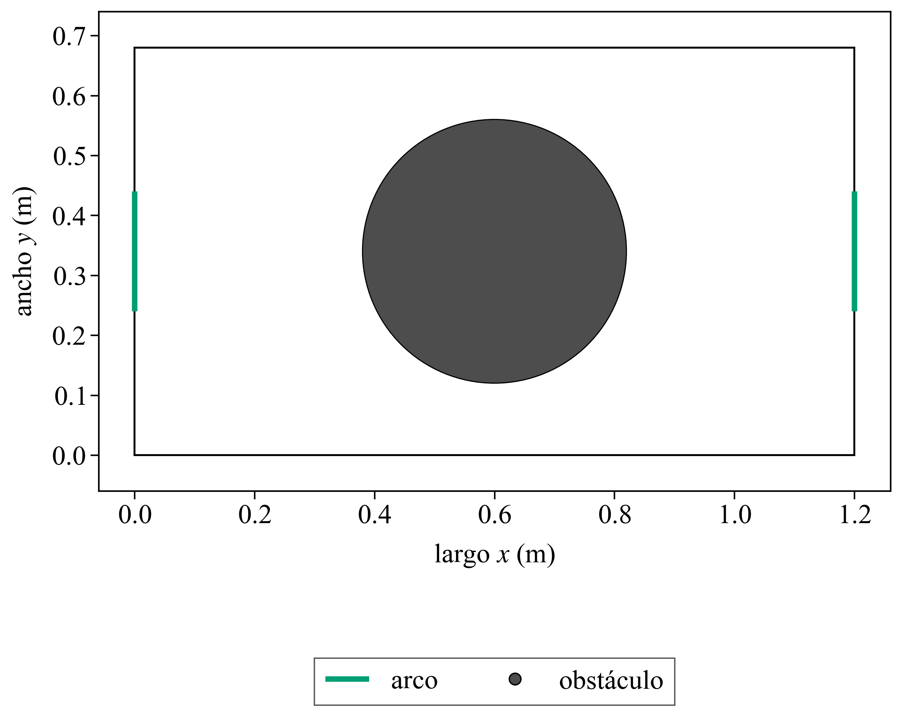
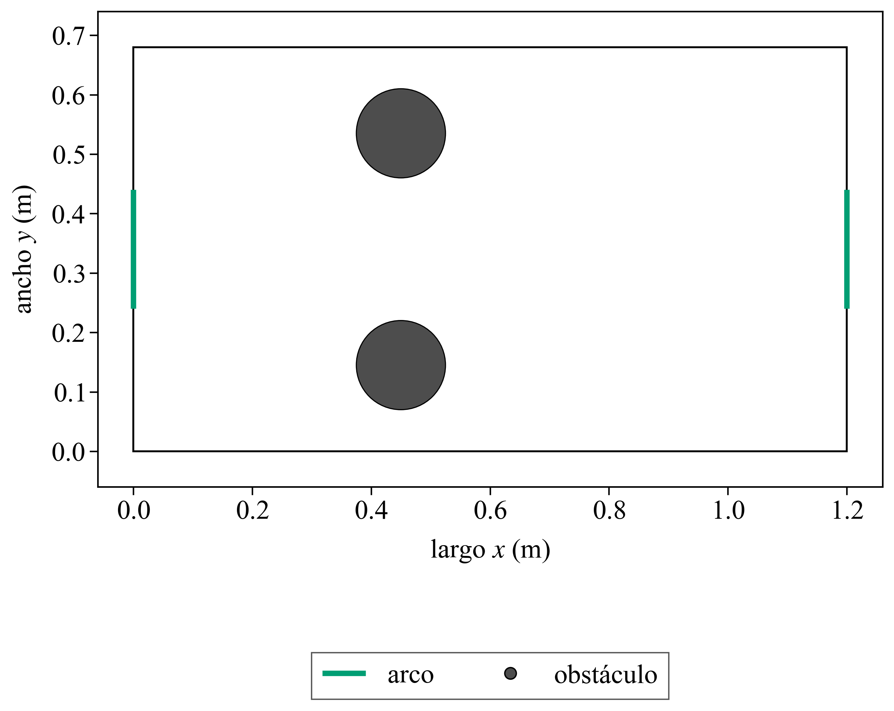
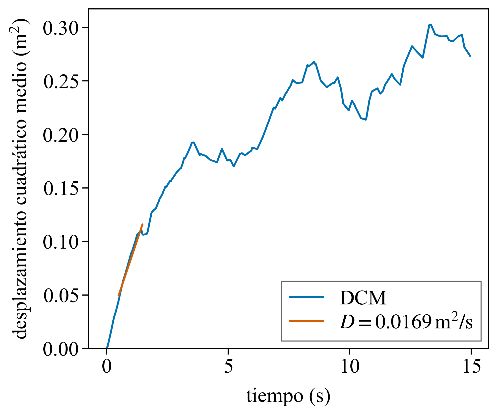
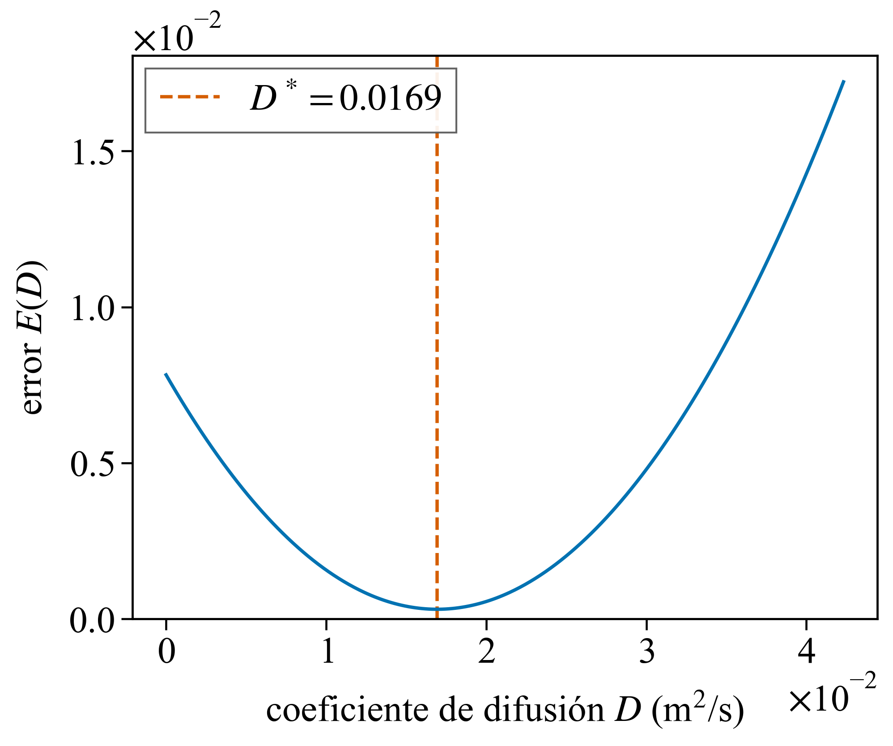
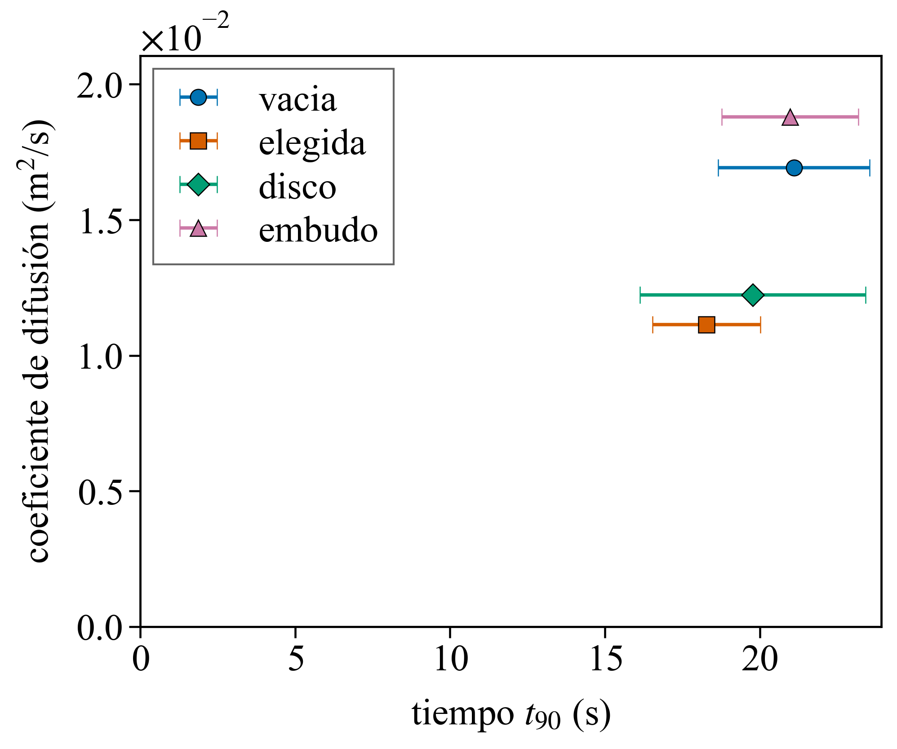

# 1.3 — Coeficiente de difusión

> Notas internas.

## Consigna

Para una realización, calcular el desplazamiento cuadrático medio promediando sobre
todas las partículas móviles, frescas y usadas. Ajustar linealmente con el método
de la Teórica 0 y obtener el coeficiente de difusión D. En 2D, ⟨Δr²⟩ = 4 D t.
Reportar D para la mesa vacía y para las otras configuraciones estudiadas, y ver
si D y ⟨t90⟩ se correlacionan.

## Cómo se midió

```
python python/run.py --exe build/EventDrivenSim.exe --outdir data/runs/1.3/msd/vacia --reps 1 --seed 401 --k 200 --tmax 100 --jobs 1 --preview none
python python/run.py --exe build/EventDrivenSim.exe --outdir data/runs/1.3/msd/elegida --obstacles configs/ga_best.txt --reps 1 --seed 401 --k 200 --tmax 100 --jobs 1 --preview none
python python/run.py --exe build/EventDrivenSim.exe --outdir data/runs/1.3/msd/disco --obstacles configs/disco_grande.txt --reps 1 --seed 401 --k 200 --tmax 100 --jobs 1 --preview none
python python/run.py --exe build/EventDrivenSim.exe --outdir data/runs/1.3/msd/embudo --obstacles configs/embudo.txt --reps 1 --seed 401 --k 200 --tmax 100 --jobs 1 --preview none
python python/run.py --exe build/EventDrivenSim.exe --outdir data/runs/1.3/t90/disco --obstacles configs/disco_grande.txt --reps 12 --seed 401 --k 0 --tmax 100 --jobs 4 --preview none
python python/run.py --exe build/EventDrivenSim.exe --outdir data/runs/1.3/t90/embudo --obstacles configs/embudo.txt --reps 12 --seed 401 --k 0 --tmax 100 --jobs 4 --preview none
python python/plotters/plot_layout.py --obstacles configs/disco_grande.txt --output docs/results/1.3/disco.png
python python/plotters/plot_layout.py --obstacles configs/embudo.txt --output docs/results/1.3/embudo.png
python python/plotters/plot_msd.py --input docs/results/1.3/msd_vacia.txt --output docs/results/1.3/msd_vacia.png --error-output docs/results/1.3/msd_error.png --t-min 0.5 --t-max 1.5
python python/plotters/plot_d_vs_t90.py --input docs/results/1.3/d_vs_t90.txt --output docs/results/1.3/d_vs_t90.png
```

- **Parámetros fijos:** los del 1.2. N = 100, v0 = 1 m/s, tmax = 100 s.
- **DCM:** una realización, semilla 401, la misma para las cuatro configuraciones. El promedio es sobre las 100 partículas, respecto de sus posiciones iniciales. El motor guarda el estado inicial, un cuadro cada 200 colisiones y cada gol.
- **Ajuste:** entre 0.5 s y 1.5 s. Antes de 0.5 s el desplazamiento todavía sale del régimen balístico (el tiempo entre colisiones es del orden de 0.1 s). Después de 2 s la mesa, que se cruza en alrededor de 1 s, dobla la curva y el DCM deja de crecer como 4 D t. El modelo es ⟨Δr²⟩ = b + 4 D t. Para cada D, b es el intercepto que minimiza E(D) = Σ [DCMᵢ − b − 4 D tᵢ]². D informado es esa pendiente dividida por 4.
- **⟨t90⟩:** semillas 401 a 412. Mesa vacía y configuración elegida: los valores de confirmación del 1.2. Disco grande y embudo: medidos en esas mismas semillas. Las barras son el desvío estándar muestral.

## Datos

| configuración | D (m²/s) | ⟨t90⟩ (s) | desvío (s) | llegaron a Fu = 0.9 |
|---|---|---|---|---|
| elegida | 0.0111 | 18.28 | 1.74 | 12 / 12 |
| disco grande | 0.0122 | 19.77 | 3.65 | 12 / 12 |
| embudo | 0.0188 | 20.98 | 2.21 | 12 / 12 |
| mesa vacía | 0.0169 | 21.11 | 2.45 | 12 / 12 |

D es de una sola realización, así que no tiene desvío. El disco grande es un obstáculo en (0.60 m, 0.34 m) con R = 0.22 m (`configs/disco_grande.txt`). El embudo son dos discos de R = 0.075 m en x = 0.45 m, y = 0.145 m y y = 0.535 m (`configs/embudo.txt`). Los dos salen de los arreglos con los que arrancó la búsqueda del 1.2. La elegida es `configs/ga_best.txt`.

## Figuras

### Disco grande y embudo





- El disco grande tapa la franja de los arcos y deja un pasillo contra cada pared larga.
- El embudo deja una abertura de 0.24 m, centrada a la altura de los arcos.

### DCM de la mesa vacía y ajuste



- La recta es el ajuste entre 0.5 s y 1.5 s. D = 0.0169 m²/s.
- Después de esa ventana la pendiente baja. Hasta los 15 s el DCM se queda entre 0.22 y 0.30 m²; la recta del ajuste, seguida hasta ahí, pasaría de 1 m².

### Error del ajuste



- E(D) tiene un mínimo en D = 0.0169 m²/s, el mismo valor que la pendiente dividida por 4.

### D y ⟨t90⟩



- La configuración elegida tiene el D más bajo (0.0111 m²/s) y el ⟨t90⟩ más bajo (18.28 s). La mesa vacía y el embudo quedan juntos, con D cerca de 0.017–0.019 m²/s y ⟨t90⟩ cerca de 21 s.
- Las barras se solapan entre el disco, el embudo y la mesa vacía. La separación que queda fuera de ese desvío es la de la configuración elegida respecto de la mesa vacía.
- Los obstáculos de la configuración elegida bajan la difusión y adelantan los goles: el menor D y el menor ⟨t90⟩ coinciden.

## Notas y conclusiones

- En la mesa vacía, D = 0.0169 m²/s en la ventana 0.5–1.5 s de la semilla 401. En la configuración elegida, D = 0.0111 m²/s. El disco grande da 0.0122 m²/s y el embudo 0.0188 m²/s.
- ⟨t90⟩, en las semillas 401 a 412, va de 18.28 ± 1.74 s (elegida) a 21.11 ± 2.45 s (mesa vacía). Las 12 realizaciones de cada configuración llegan a Fu = 0.9.
- D y ⟨t90⟩ bajan juntos al pasar de la mesa vacía a la configuración elegida. El embudo queda junto a la mesa vacía en las dos cantidades. La configuración que minimiza ⟨t90⟩ es la de menor difusión.
