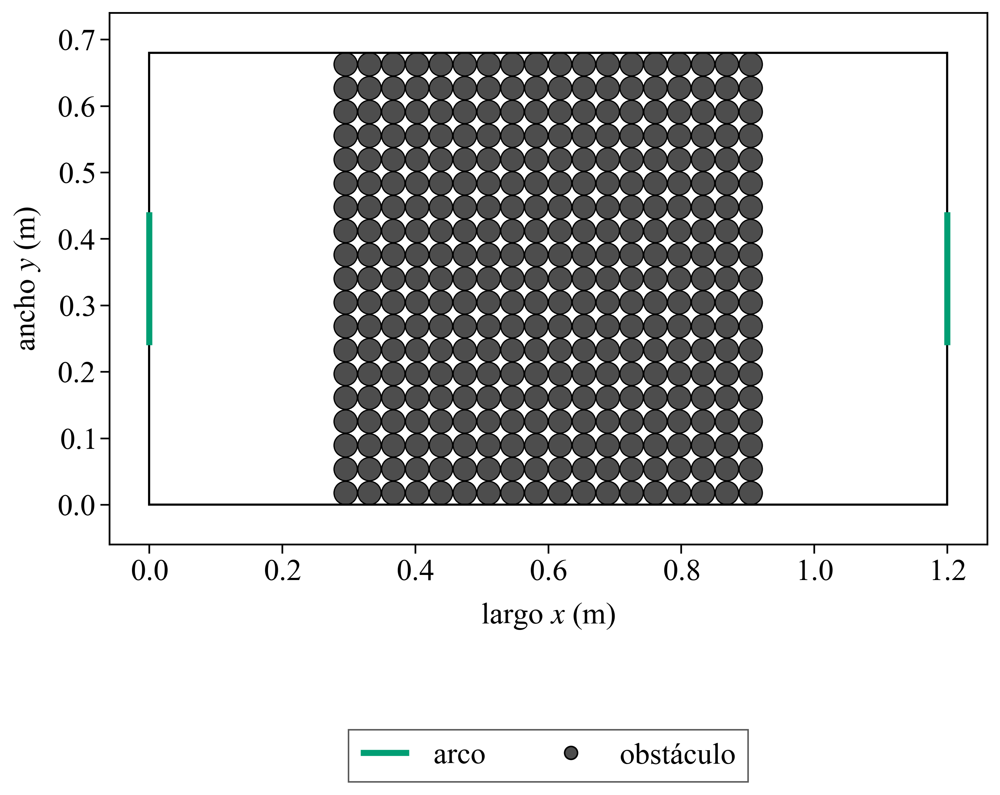
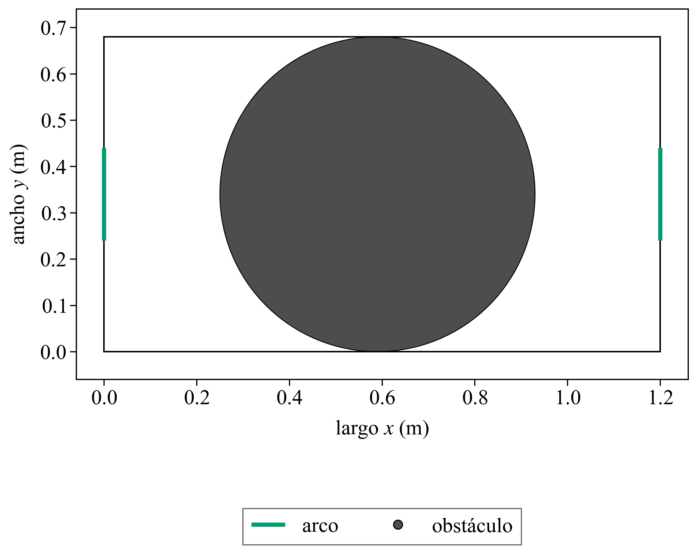

# 1.3 — Coeficiente de difusión

> Notas internas.

## Consigna

Para una realización, calcular el desplazamiento cuadrático medio promediando sobre
todas las partículas móviles, frescas y usadas. Ajustar linealmente con el método
de la Teórica 0 y obtener el coeficiente de difusión D. En 2D, ⟨Δr²⟩ = 4 D t.
Reportar D para la mesa vacía y para las otras configuraciones estudiadas, y ver
si D y ⟨t90⟩ se correlacionan.

## Cómo se midió

```
python python/run.py --exe build/EventDrivenSim.exe --outdir data/runs/1.3/msd/vacia --reps 1 --seed 401 --k 200 --tmax 100 --jobs 1 --preview none
python python/run.py --exe build/EventDrivenSim.exe --outdir data/runs/1.3/msd/elegida_full --obstacles configs/ga_best.txt --reps 1 --seed 401 --k 200 --tmax 100 --jobs 1 --preview none
python python/run.py --exe build/EventDrivenSim.exe --outdir data/runs/1.3/msd/disco --obstacles configs/disco_grande.txt --reps 1 --seed 401 --k 200 --tmax 100 --jobs 1 --preview none
python python/run.py --exe build/EventDrivenSim.exe --outdir data/runs/1.3/msd/embudo --obstacles configs/embudo.txt --reps 1 --seed 401 --k 200 --tmax 100 --jobs 1 --preview none
python python/run.py --exe build/EventDrivenSim.exe --outdir data/runs/1.3/msd/pared_18 --obstacles data/runs/1.2/pared_rmin/r0.0175_c18_x0.60.txt --reps 1 --seed 401 --k 200 --tmax 100 --jobs 1 --preview none
python python/run.py --exe build/EventDrivenSim.exe --outdir data/runs/1.3/t90/disco_601 --obstacles configs/disco_grande.txt --reps 12 --seed 601 --k 0 --tmax 100 --jobs 4 --preview none
python python/run.py --exe build/EventDrivenSim.exe --outdir data/runs/1.3/t90/embudo_601 --obstacles configs/embudo.txt --reps 12 --seed 601 --k 0 --tmax 100 --jobs 4 --preview none
python python/plotters/plot_layout.py --obstacles configs/ga_best.txt --output docs/results/1.3/elegida.png
python python/plotters/plot_layout.py --obstacles data/runs/1.2/pared_rmin/r0.0175_c18_x0.60.txt --output docs/results/1.3/pared.png
python python/plotters/plot_layout.py --obstacles configs/disco_grande.txt --output docs/results/1.3/disco.png
python python/plotters/plot_layout.py --obstacles configs/embudo.txt --output docs/results/1.3/embudo.png
python python/plotters/plot_msd.py --input docs/results/1.3/msd_vacia.txt --output docs/results/1.3/msd_vacia.png --error-output docs/results/1.3/msd_error.png --t-min 0.5 --t-max 1.5
python python/plotters/plot_d_vs_t90.py --input docs/results/1.3/d_vs_t90.txt --output docs/results/1.3/d_vs_t90.png
```

- **Parámetros fijos:** los del 1.2. N = 100, v0 = 1 m/s, tmax = 100 s.
- **DCM:** una realización, semilla 401, la misma para las cinco configuraciones. El promedio es sobre las 100 partículas, respecto de sus posiciones iniciales. El motor guarda el estado inicial, un cuadro cada 200 colisiones y cada gol.
- **Ajuste:** entre 0.5 s y 1.5 s. Antes de 0.5 s el desplazamiento todavía sale del régimen balístico (el tiempo entre colisiones es del orden de 0.1 s). Después de 2 s la mesa, que se cruza en alrededor de 1 s, dobla la curva y el DCM deja de crecer como 4 D t. El modelo es ⟨Δr²⟩ = b + 4 D t. Para cada D, b es el intercepto que minimiza E(D) = Σ [DCMᵢ − b − 4 D tᵢ]². D informado es esa pendiente dividida por 4.
- **⟨t90⟩:** semillas 601 a 612, las de confirmación del 1.2. Mesa vacía, configuración elegida y pared de 18 columnas: esos valores. Disco grande y embudo: medidos en esas mismas semillas. Las barras son el desvío estándar muestral.

## Datos

| configuración | D (m²/s) | ⟨t90⟩ (s) | desvío (s) | llegaron a Fu = 0.9 |
|---|---|---|---|---|
| pared, 18 columnas | 0.00497 | 13.67 | 1.31 | 12 / 12 |
| elegida | 0.00465 | 15.61 | 2.47 | 12 / 12 |
| disco grande | 0.0122 | 19.72 | 3.19 | 12 / 12 |
| embudo | 0.0188 | 21.70 | 3.04 | 12 / 12 |
| mesa vacía | 0.0169 | 23.76 | 3.22 | 12 / 12 |

D es de una sola realización, así que no tiene desvío. La pared es la de radio 0.0175 m, 18 columnas y centro en x = 0.60 m. La elegida es el disco de R = 0.34 m centrado en (0.59 m, 0.34 m), `configs/ga_best.txt`. El disco grande es un obstáculo en (0.60 m, 0.34 m) con R = 0.22 m (`configs/disco_grande.txt`). El embudo son dos discos de R = 0.075 m en x = 0.45 m, y = 0.145 m y y = 0.535 m (`configs/embudo.txt`).

## Figuras

### Pared, elegida, disco grande y embudo






- La pared tiene círculos de radio 0.0175 m, 18 columnas y centro en x = 0.60 m. El hueco entre círculos es 0.8 mm, menor que el diámetro de una partícula.
- La elegida es un disco de radio 0.34 m en (0.59 m, 0.34 m). Ocupa todo el ancho y toca las dos paredes largas.
- El disco grande tapa la franja de los arcos y deja un pasillo contra cada pared larga.
- El embudo deja una abertura de 0.24 m, centrada a la altura de los arcos.

### DCM de la mesa vacía y ajuste


- La recta es el ajuste entre 0.5 s y 1.5 s. D = 0.0169 m²/s.
- Después de esa ventana la pendiente baja. Hasta los 15 s el DCM se queda entre 0.22 y 0.30 m²; la recta del ajuste, seguida hasta ahí, pasaría de 1 m².

### Error del ajuste


- E(D) tiene un mínimo en D = 0.0169 m²/s, el mismo valor que la pendiente dividida por 4.

### D y ⟨t90⟩


- La pared tiene el menor ⟨t90⟩ (13.67 s) y un D casi igual al de la elegida (0.00497 contra 0.00465 m²/s). La elegida sigue con el menor D. El disco grande queda en el medio en las dos (0.0122 m²/s y 19.72 s).
- El embudo tiene más difusión que la mesa vacía (0.0188 contra 0.0169 m²/s) y un ⟨t90⟩ menor (21.70 s contra 23.76 s).
- Entre la elegida y la mesa vacía las barras no se solapan: 8.15 s de diferencia de medias, con desvíos de 2.47 s y 3.22 s. El disco y el embudo sí se solapan con la mesa vacía. Las de la pared y la elegida también: 13.67 + 1.31 = 14.98 s y 15.61 − 2.47 = 13.14 s.

## Notas y conclusiones

- D es el de la ventana 0.5–1.5 s, semilla 401. ⟨t90⟩ es el de las semillas 601 a 612. Las 12 realizaciones de cada configuración llegan a Fu = 0.9.
- La pared de 18 columnas tiene el menor ⟨t90⟩ y un D casi igual al de la elegida, que sigue siendo el menor. El disco grande queda en el medio. El embudo no sigue esa orden: difunde más que la mesa vacía y aun así llega un poco antes. El D chico de la pared y de la elegida sale de que las dos tapan el ancho y el desplazamiento en y se satura enseguida.
